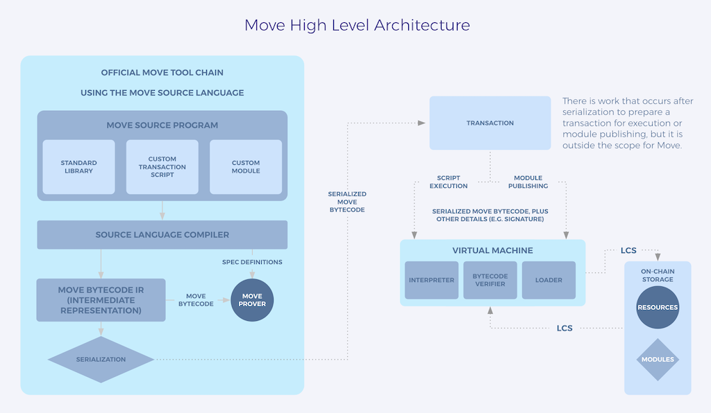

# Introduction to Move: A Language Designed for Digital Assets

Get to know Move, a language specifically developed for handling digital assets effectively and safely.

## What is Move?

Move is a language crafted by the Diem project team at Facebook in 2020. Its design mimics some principles from Rust, with a focus on enhancing the management of digital assets types on Blockchain technologies. With Move, the traditional security risks and inefficiencies associated with earlier languages are mitigated.

## Characteristics of Move

Here are some key features that make Move a standout language:

- **Resources Concept**: Move emphasizes a resources paradigm where digital assets are seen as distinct items that can't be copied or misplaced.
- **Move Prover**: This is an in-built validation tool in Move. Its responsibility is to ensure that programs align with the rules declared and are free from errors. This boosts its security.
- **BCS Bytecode Compilation**: Programs written in Move are compiled into Binary Canonical Serialization (BCS) bytecode, a format that's both secure and efficient for different Blockchain applications.
- **Flexibility and Scalability**: Move supports a range of applications from simple transactions to complex financial commitments. It also allows developers to build reusable modules.
- **Open Source**: Move is open-source and governed by the community. This allows for adjustments and evolution to meet the changing trends in digital finance.

## Conclusion

Move provides a solid framework for managing digital assets efficiently and securely. Its innovative characteristics and community-driven growth ensure that Move stays relevant in digital finance.

## References

1. The Language of Money, Part One: What Motivated the Creation of Move? Diem Blog: [https://www.diem.com/en-us/blog/why-build-move/](https://www.diem.com/en-us/blog/why-build-move/)
